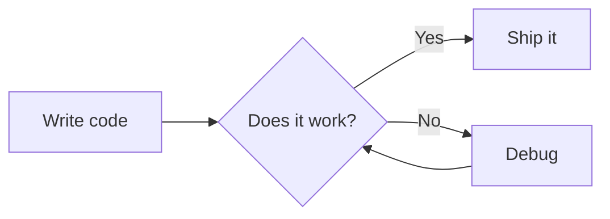

# StoryTeller

A desktop story authoring and Markdown reading app for macOS, built with C++ and wxWidgets. StoryTeller can organize projects, generate and edit chapter files with LLM backends, render rich Markdown, and keep per-chapter conversations alongside the document.

The viewer still works fully offline for Markdown rendering: syntax-highlighted code, [Mermaid](https://mermaid.js.org) diagrams, collapsible tidbits, and light/dark mode are embedded into the app at build time.

## Features

- **Project browser** — manage generated story projects from the Projects tab and reopen the active project quickly
- **Project metadata** — records last-opened time and recent successful LLM operation timings in each project's `.storyteller.json`
- **LLM generation** — create chapter files from a topic, style, and character selections
- **LLM editing** — rewrite chapters or tidbits, translate files, and preserve stable chapter/tidbit markers
- **Personality conversations** — ask questions about the topic you generated and continue the discussion with personality-driven voices saved in the Markdown as `:::conversation[...]` blocks
- **Markdown rendering** — headings, bold, italic, strikethrough, inline code, links, images, blockquotes, ordered/unordered lists, tables, horizontal rules, hard line breaks
- **Syntax highlighting** — fenced code blocks highlighted by [highlight.js](https://highlightjs.org), supporting 180+ languages (cpp, python, js, rust, go, sql, …)
- **Mermaid diagrams** — flowcharts, sequence diagrams, class diagrams, Gantt charts, and more — rendered as SVG
- **Diagram zoom** — click any diagram for a full-screen view; scroll to zoom, drag to pan, ESC to close
- **Collapsible tidbits** — a `:::tidbit[Name]` extension for show/hide asides (see below)
- **Light / dark mode** — toggle via the View menu; preference is persisted between sessions
- **Adjustable font size** — increase, decrease, or reset via the View menu or keyboard shortcuts
- **Fully offline** — Mermaid.js and highlight.js are compiled into the binary at build time; no network required at runtime
- **LLM authoring support** — `story-teller --llm` prints a syntax reference you can paste straight into an LLM context

## Dependencies

| Dependency | Version | Notes |
|---|---|---|
| [wxWidgets](https://wxwidgets.org) | 3.2+ | Core GUI + WebView + WebKit |
| CMake | 3.16+ | Build system |
| `xxd` | any | Ships with Vim / available on macOS |
| Internet (build only) | — | Auto-downloads `mermaid.min.js` and `highlight.js` once at configure time |

```bash
brew install wxwidgets
```

Optional direct LLM backends use local command-line tools or API access:

- Claude CLI
- Codex CLI
- Gemini CLI
- Ollama
- Anthropic API key

Clipboard mode requires none of these; it copies the generated prompt so you can paste it into any LLM manually.

## Build

```bash
git clone https://github.com/your-username/story-teller.git
cd story-teller
cmake -B build && cmake --build build
```

On first configure, CMake downloads `mermaid.min.js` and `highlight.js` automatically and embeds them into the binary via `xxd`. All subsequent builds are fully offline.

### Install

```bash
sudo ln -s "$(pwd)/build/story-teller" /usr/local/bin/story-teller
```

## Usage

```bash
story-teller
story-teller <file.md>
story-teller <file.html>
```

Open the app without a file to use the Projects, Create, Edit, and View tabs.

### Keyboard shortcuts

| Shortcut | Action |
|---|---|
| `Ctrl+O` | Open file |
| `Ctrl+R` | Reload current file |
| `Ctrl+Shift+L` | Light mode |
| `Ctrl+Shift+D` | Dark mode |
| `Ctrl++` | Increase font size |
| `Ctrl+-` | Decrease font size |
| `Ctrl+0` | Reset font size |
| `ESC` | Close diagram zoom |
| `Ctrl+Q` | Quit |

## Syntax

StoryTeller renders standard Markdown. A few highlights:

### Code blocks with syntax highlighting

````markdown
```rust
fn main() {
    println!("Hello, world!");
}
```
````

Any language tag recognised by highlight.js works.

### Mermaid diagrams

````markdown

````

Click the rendered diagram to open the zoom modal.

### Tidbits — collapsible asides

Tidbits are a StoryTeller extension for adding show/hide commentary alongside main content. They're designed for LLM-generated documents where you want entertaining or supplementary notes from a named voice that readers can reveal at their own pace.

```markdown
:::tidbit[Bjarne Stroustrup]
"I could have hidden vtables entirely. I chose not to —
the indirection *is* the point. You are welcome."
:::
```

This renders as a collapsed `<details>` widget labelled with the speaker's name. Click to reveal the content. No JavaScript required — it's a native HTML element.

**Rules:**
- Opening line: `:::tidbit[Speaker Name]`
- Closing line: `:::` (on its own line)
- Body supports any StoryTeller markdown (paragraphs, bold, lists, code)
- Put a blank line before and after the block

### Conversations

Conversation history is stored directly in the Markdown document in a `:::conversation[...]` block associated with a chapter marker. Use it to ask follow-up questions about the topic you generated, request references, or continue the discussion in a specific personality or voice.

```markdown
<!-- ch:1 -->
## Chapter 1: Arrival

:::conversation[Chapter 1: Arrival]
Q: What does the opening imply?
A: It suggests the character is entering a place they already fear.

Q: Answer as an old lighthouse keeper. From above, can you provide a reference?
A: ...
:::
```

When you ask a new chat question, StoryTeller sends the full document plus the saved Q/A turns for the current chapter. The LLM can answer follow-ups like "from above" when the reference appears in that chapter's saved conversation or in the document, and it can adopt the personality or perspective you ask for in the prompt. It does not automatically know unrelated app sessions or prior conversations unless StoryTeller includes them in the prompt.

## LLM authoring

StoryTeller is designed to work well as an LLM output renderer. The `--llm` flag prints a complete syntax reference you can paste into any LLM context:

```bash
story-teller --llm
```

This outputs a Markdown document covering every supported feature and the `:::tidbit` extension, so the LLM knows exactly what it can generate.

**Example workflow — ask Claude to write a C++ vtable explainer with tidbits:**

1. Run `story-teller --llm` and paste the output into your prompt.
2. Ask the LLM to write a technical document and add `:::tidbit[Speaker]` sections between chapters with entertaining commentary from historical figures.
3. Open the resulting `.md` file in StoryTeller. Read the chapter, then click the tidbits for a breather.

## Project metadata

Each project can contain a `.storyteller.json` file. StoryTeller updates it automatically when a project is activated and after successful direct LLM calls:

```json
{
  "lastOpened": "2026-05-16T14:23:00",
  "timings": [
    {"ts": "2026-05-16T14:24:10", "op": "generate", "topic": "Opening chapter", "secs": 87}
  ]
}
```

The Projects tab displays this as a compact status line, such as `Opened: 2026-05-16 14:23   Last generate: 1m 27s - Opening chapter`. The timings list is capped at the most recent 100 entries.

## How it works

```
story-teller file.md
    │
    ├─ RenderMarkdown()    hand-written block + inline parser → HTML body
    │                      handles :::tidbit blocks recursively
    │
    ├─ BuildHTML()         wraps body in a full HTML page:
    │     • inlines mermaid.min.js and highlight.js as <script> tags
    │     • applies CSS theme tokens (light / dark via custom properties)
    │     • adds zoom modal, font-size controls, tidbit <details> styles
    │
    └─ wxWebView::SetPage()  hands the HTML to an embedded WebKit engine
                             WebKit runs Mermaid, renders SVG diagrams
```

`mermaid.min.js` and `highlight.js` are never fetched at runtime. At build time, CMake runs `xxd -i` to convert each file into a C byte array compiled directly into the binary.

## Project structure

```
story-teller/
├── src/
│   ├── markdown.h/cpp        — RenderMarkdown, ProcessInline, EscapeHTML, GetLLMReadme
│   ├── html_template.h/cpp   — BuildHTML (full HTML page, CSS, embedded JS)
│   ├── app frame             — tabs, menus, file I/O, event handling
│   ├── create_panel.h/cpp    — project/chapter generation UI
│   ├── edit_panel.h/cpp      — rewrite, translate, file order, and git tools
│   ├── project_panel.h/cpp   — project list, activation, metadata summary
│   ├── conversation.h/cpp    — chapter chat parsing, persistence, prompt building
│   ├── meta.h/cpp            — .storyteller.json load/save and LLM timing records
│   └── main.cpp              — entry point, --llm flag, posix_spawn detach
├── tests/
│   └── test_*.cpp            — unit tests (no wxWidgets dependency)
├── CMakeLists.txt
├── CLAUDE.md                 — coding conventions for Claude Code
└── sample.md                 — feature demo
```

## License

MIT
