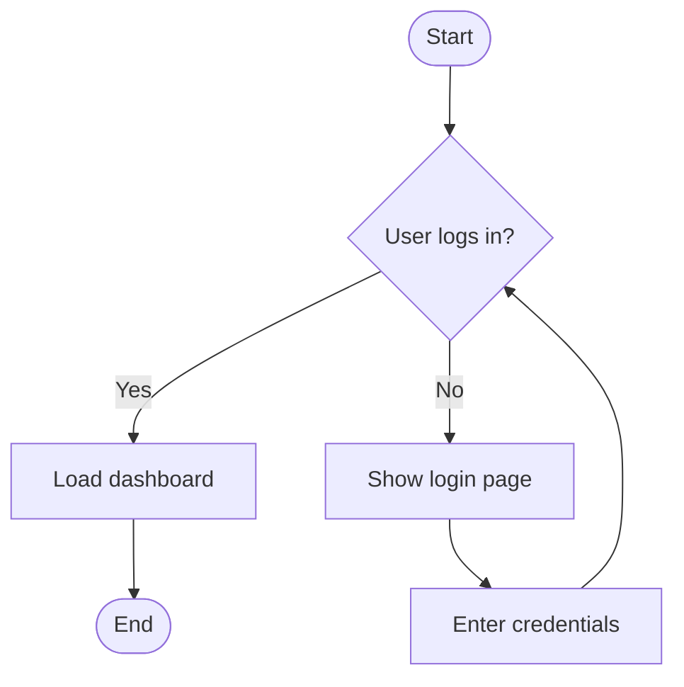
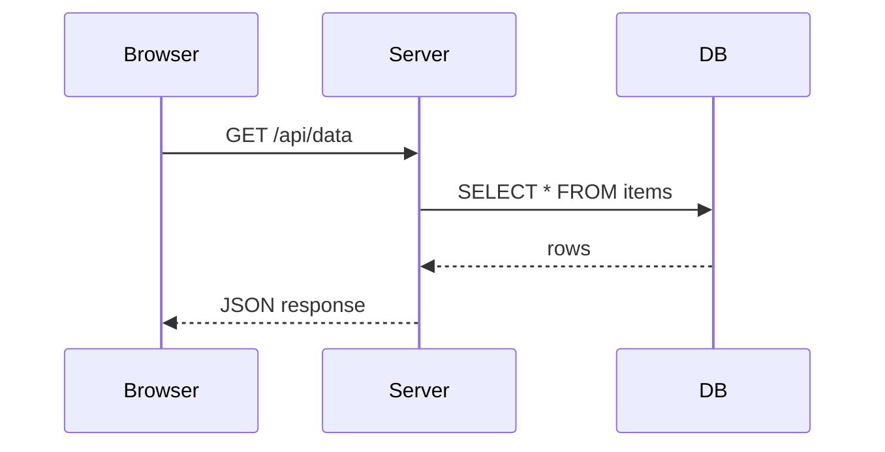
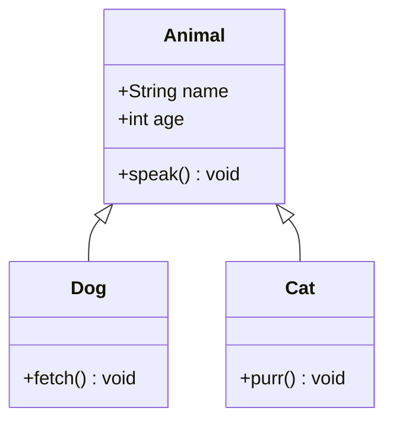
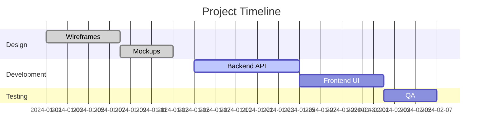
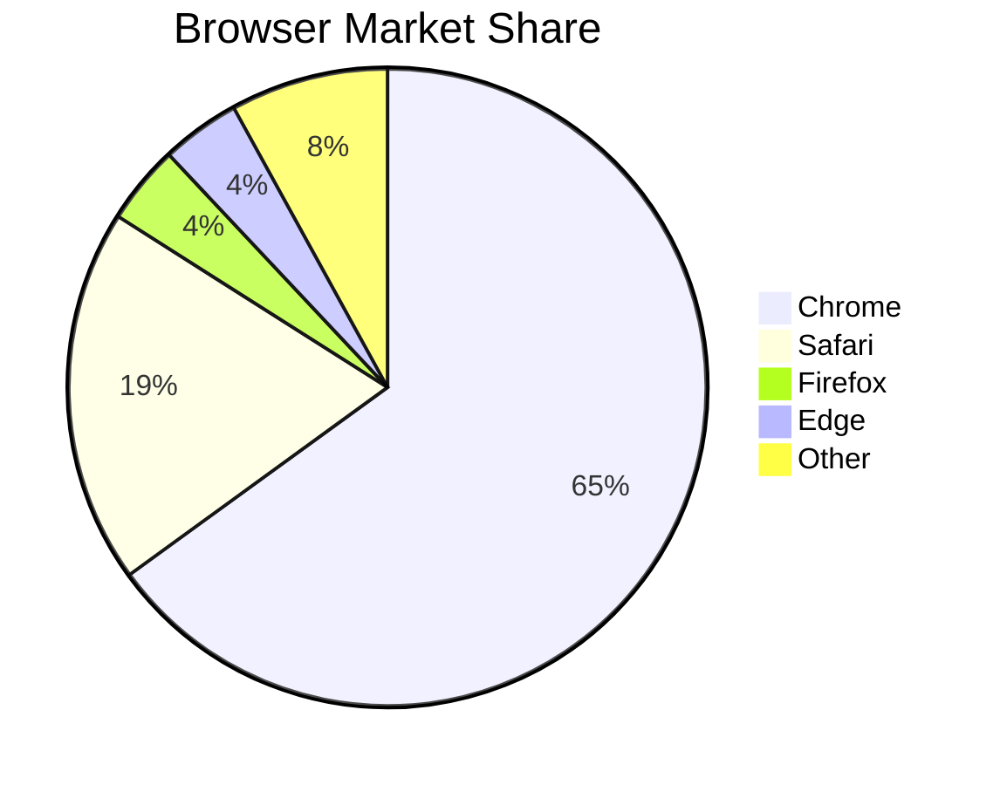

# Sample Markdown with Mermaid

A quick tour of **MDViewer** — bold, *italic*, `inline code`, and ~~strikethrough~~.

---

## Flowchart



## Sequence Diagram



## Class Diagram



## Gantt Chart



## Pie Chart



---

## Code Block (non-Mermaid)

```python
def fibonacci(n: int) -> int:
    if n <= 1:
        return n
    return fibonacci(n - 1) + fibonacci(n - 2)

print(fibonacci(10))  # 55
```

## Table

| Diagram type  | Keyword        | Supported |
|---------------|----------------|-----------|
| Flowchart     | `flowchart`    | ✅        |
| Sequence      | `sequenceDiagram` | ✅     |
| Class         | `classDiagram` | ✅        |
| Gantt         | `gantt`        | ✅        |
| Pie           | `pie`          | ✅        |

> **Tip:** Click any diagram to open the full-screen zoom view.  
> Scroll to zoom · drag to pan · ESC to close.
