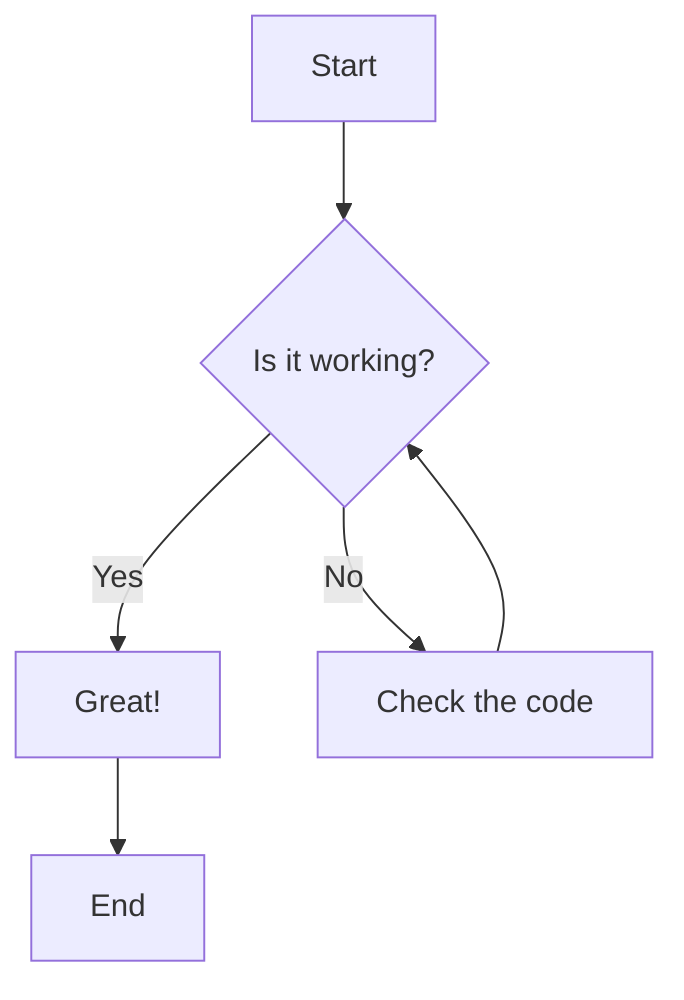
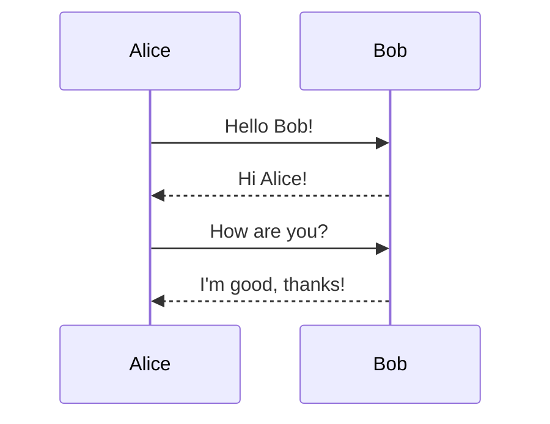

# MDViewer Test

A quick test of **bold**, *italic*, `inline code`, and ~~strikethrough~~.

## Links & Images

[OpenAI](https://openai.com) · [Anthropic](https://anthropic.com)

## Code Block

```python
def greet(name: str) -> str:
    return f"Hello, {name}!"
```

## Mermaid Diagram

Click the diagram below to open the zoom view.



## Sequence Diagram



## Table

| Feature       | Supported |
|---------------|-----------|
| Headers       | ✅        |
| Bold/Italic   | ✅        |
| Code blocks   | ✅        |
| Mermaid       | ✅        |
| Zoom          | ✅        |
| Tables        | ✅        |

## Blockquote

> This is a blockquote.
> It can span multiple lines.

## Horizontal Rule

---

End of test.
